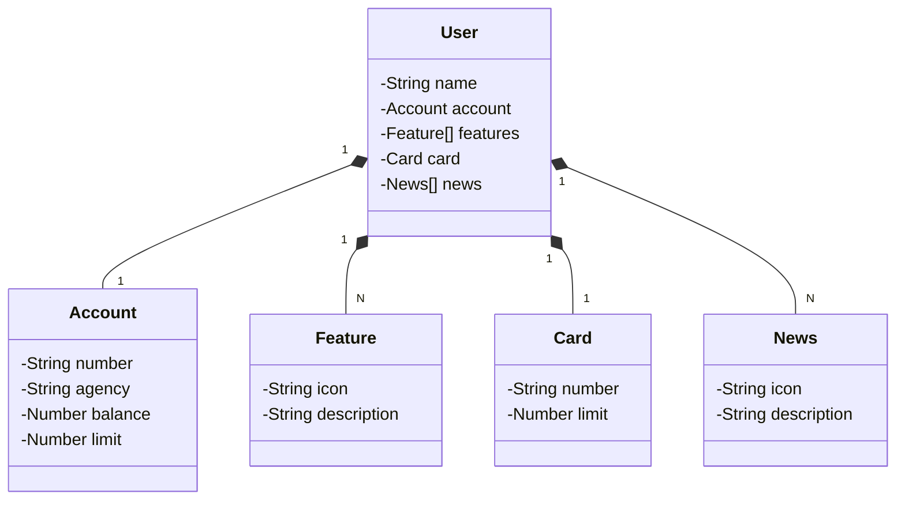

# proj-028

> Status do Projeto: :alarm_clock: EM ANDAMENTO

## Descrição

Este é um projeto de uma API REST para o desafio Publicando Sua API REST na Nuvem Usando Spring Boot 3, Java 17 e Railway da DIO.

## Tecnologias utilizadas

| Tecnologia         | Versão  |
| ------------------ | ------- |
| Java               | 17      |
| Spring             | 3.1.4   |
| H2 Database        | 2.1.214 |
| Springdoc Open API | 2.2.0   |
| Lombok             | 1.18.30 |

## Profiles

Para esta aplicação foi criado o perfil:

* test - para subir a aplicação em memória utilizando o H2

## Diagrama de classes

## Endpoints

### Users

| Método HTTP | Prefixo | Endpoint          | Descrição                               |
| ----------- | ------- | ----------------- | --------------------------------------- |
| GET         | /api/v1 | /user             | Retorna uma lista paginada de usuários  |
| GET         | /api/v1 | /user/1           | Retorna o usuário com o id 1            |
| POST        | /api/v1 | /user             | Cria um usuário                         |
| PUT         | /api/v1 | /user/1           | Atualiza o usuário com o id 1           |
| DELETE      | /api/v1 | /user/1           | Remove o usuário com o id 1             |

## Documentação Springdoc Open API 

No browser acesse <http://localhost:8082/swagger-ui/index.html>

## Licença

The [MIT License]() (MIT)
Copyright :copyright: 2023 - proj-028
